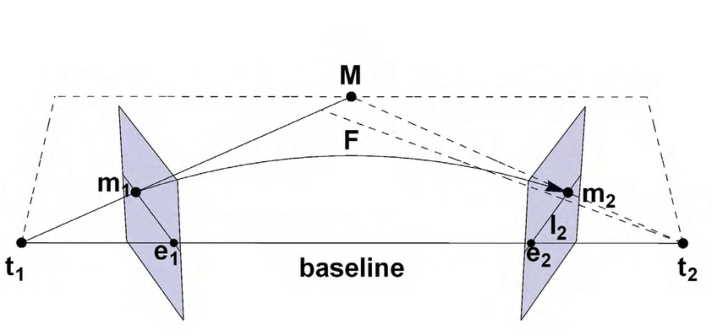
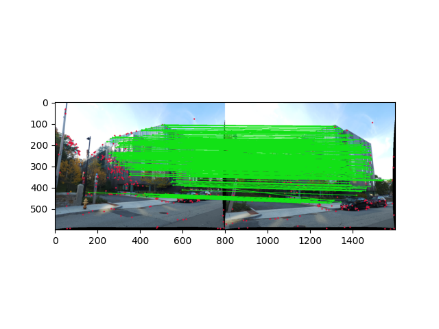
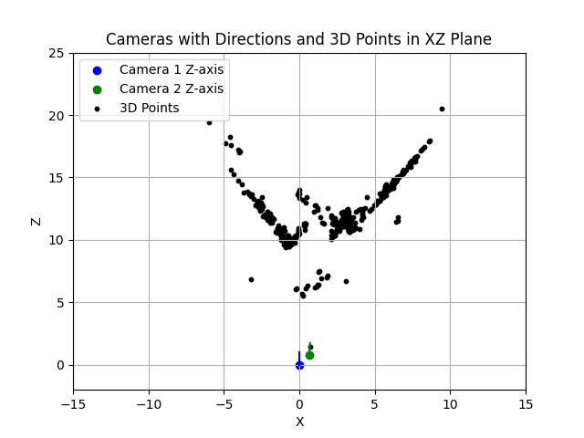
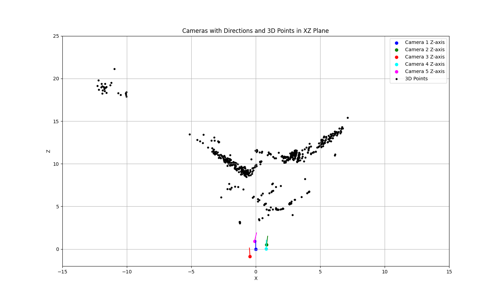

# Structure from Motion (SfM) with Python and Numpy  

## Overview  
This project implements a Structure from Motion (SfM) pipeline using Python to reconstruct 3D scenes from 2D images. SfM is a computer vision technique used for 3D reconstruction and is widely applied in robotics, AR/VR, and mapping.  

## Pipeline 
  
- **Fundamental Matrix Estimation:** Computing the epipolar geometry between image pairs.

 



- **Essential Matrix Decomposition:** Estimating camera pose (rotation and translation).  
- **Triangulation:** Reconstructing 3D points using matched features and estimated poses.  

- **PnP:** Using perspective-n-points algorithm to register new camera poses. 

- **Bundle Adjustment:** Refining camera parameters and 3D points to minimize re-projection error.  

## Dependencies  
- Python 3.8 or higher   
- NumPy  
- Matplotlib  
- SciPy  

Install dependencies using:  
```bash  
pip install opencv-python numpy matplotlib scipy  
